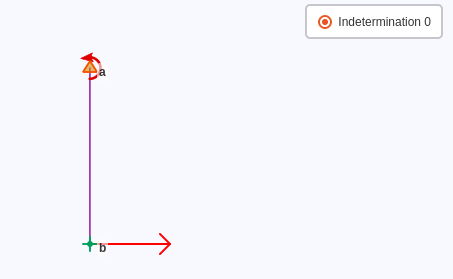

.. _computation:

===========
Computation
===========

In the least-squares bundle adjustment, there are two main entities:
 
- parameters corresponding to unknowns (e.g., points coordinates, stations orientations)

- observations corresponding to measurements or points constraints.

Since the equation system is non-linear, initial values are required for all parameters (see :ref:`cap-init`) and iterations are done until convergence.

.. _coord-systems:

Coordinates Systems
=====================

.. _spherical-coord:

Spherical Coordinates
----------------------

The compensation is done in |c3| spherical computation frame close to a local stereographical projection.

Its origin `(0,0)` corresponds to project local center (see :ref:`project-params`),
`h` direction follows the Earth curvature (assimilated to a sphere), and `N` direction
at the origin corresponds to the geographic north direction.

.. note::

   Azimuths (observation code ``8``) and :math:`\sigma` are always given in spherical coordinates, therefore there is no
   scale error nor convergence of meridians.

Input coordinates (in any user-chosen projection) is converted into spherical frame for computation
and final coordinates are converted back into user's projection for output.

.. note::

   The spherical Earth approximation limits the precision of topometric computations. The average error is around:
   
     - 4 µm in planimetry and 0.1 mm in altimetry for a 1 km network
     - 4 mm in planimetry and 10 mm in altimetry for a 10 km network
     - 4 m in planimetry and 1 m in altimetry for a 100 km network
   
   See ex/big_1km, ex/big_10km and ex/big_100km for illustrations

.. _proj-coord:

Projection Coordinates
-------------------------

Projection coordinates are used for :ref:`.cor <corfiles>` and :ref:`.new <out-coord>` files.

.. _local-proj:

Local Projection
~~~~~~~~~~~~~~~~~

If the points are given in a local stereographical projection, the
approximate Earth radius is determined from the ellipsoid curvature at the project latitude.

The tangency point of the local stereographic projection is the project center.

`N` is supposed to be the north direction.

.. _georef-proj:

Georeferenced Projection
~~~~~~~~~~~~~~~~~~~~~~~~

When a georeferenced projection is used, the project center is the origin of the computation frame
and the approximate Earth radius is determined from the ellipsoid curvature at the latitude of the project's center.

.. _cart-coord:

Cartesian Coordinates
-------------------------

|c3| uses cartesian coordinates for subframes adjustment (see :ref:`cartesian-subframe`) and for export.

The *global cartesian frame* coincides with the spherical computation frame at project's center.
The global cartesian compensated coordinates of each point can be exported with :ref:`export-coord` tool.
If the project is georeferenced, the transformation from global cartesian to geocentric cartesian coordinates is given in the computation report (see :ref:`computation-info`).

The transformations between each subframe and the global cartesian frame are automatically written as comments at the end of each *.xyz* file.

.. _coord-proj-transfo:

Cartesian/Projection Transformation
--------------------------------------

The transformation between a cartesian frame and any projection can be done using the tool :ref:`cart-proj`.

.. _obs-deflection:

Vertical Deflection
-----------------------------------

The 3D computation is done in a local geodetic frame, where `h` follows the ellipsoid and not the plumb line.

Many observations are affected by vertical deflection (e.g., topometric angles, leveling, instruments and target heights...) since instruments are verticalized to plumb line.
To fix those measurements, vertical deflection value is to be given in *.cor* files for all points where an instrument or a target was verticalized (see :ref:`corfiles`).

.. note::
   If the vertical deflection is missing on a point where it is mandatory, no deflection will be used in the whole project, and a warning will appear when loading the project.

.. _cap-init:

Parameters Initialization
==============================

Non-linear least squares adjustment requires coherent initial values for all parameters.

:ref:`.cor <corfiles>` files are used to initialize parameters for declared points.
The other parameters are initialized in an iterative process using observations and initialized points.

This process uses several methods to estimate the approximate position of a point
from different sets of observations. If a point is impossible to initialize, the point will not be used in computation and a warning message is displayed.

The set of declared points has to be sufficient to be able to initialize everything. Usually,
a constrained station and one of its targets are sufficient.

At the end of this process, the initial coordinates of the points are available and can be exported with in the :ref:`export-to-cor` tool.

.. network-constraints:

Network Contraints
====================

In order to find solutions for all least squares parameters, external constraints are needed in addition to topometric observations in order to set the position and orientation of the project.

.. _compens-free:

Free Compensation
-------------------

A free compensation is done when minimal external constraints are applied, which means as many constraints as the number of degrees of freedom.

For standard topometric measurements, the global translation and the global horizontal rotation
have to be set. Using four constraints for those four degrees of freedom is a free compensation: the external constraints will not interfere with the measurements, making network debugging easier.

.. _set-reference-frame:

Set Reference Frame
-----------------------

Several points may have to be constrained to set the network in a known reference frame.

Inconsistency between the constraints and the observations increases the residuals values.

.. _rank-deficiency:

Rank Deficiency
----------------

A rank deficiency of the system matrix means that there is insufficient information to solve the system.
In this case, the kernel of the linear application will be estimated and shown in the report map to help finding the network problem.

Most of the time this rank deficiency appears if there is not enough external constraints
or too many observations deactivated, creating several semi-independent subnetworks.

.. _internal-constraints:

Internal Constraints
-----------------------

To get the internal precision of a topometric network, a special set of minimal constraints is used:
instead of constraining a specific point, the `internal constraints` are applied to all points, except to `remote` points (see :ref:`corfiles`) which will not be used, to prevent their imprecision to affect the whole network in internal constraints.

Internal constraints can only be used with :ref:`normal-matrix-inversion` and with no fixed points.
If the ``Internal Constraints`` option is selected, any external constraint on the network will be removed before normal matrix inversion, and internal constraints
will be added. To get coherent results, the initial constraints must be minimal.

.. _normal-matrix-inversion:

Normal Matrix Inversion
========================

If the normal matrix is inverted, new statistical information is available:

- the variance matrix of all parameters (that can be exported with  in a :ref:`export-covar` tool)

- empirical confidence ellipsoids and intervals for points coordinates (see :ref:`confidence-indic`)

- for observations: a posteriori :math:`\sigma`, partial redondancy, standardized residual, :math:`\nabla` (biggest undetectable error / internal reliability), probable error (see :ref:`output-obs`).

This step can be long, disabling it will speed up the calculation.

.. _simulation:

Simulation
===========

Topometric networks can be simulated to have an idea of the final precision before the actual measurements are done.

A simulation input consists of points coordinates, list of observations and their precisions.

Simulation observations can be easily generated with the :ref:`matrix-obs` tool.

.. _simul-propag:

Variance Propagation Simulation
--------------------------------

In this mode, only the :ref:`normal-matrix-inversion` is done.

.. _simul-mc:

Monte-Carlo Simulation
-------------------------

In this mode, the observations residuals are randomly drawn following observations' `a priori` :math:`\sigma`
and points displacements are recorded.

The process is repeated `maximum iterations` times (see :ref:`project-params`).

In the report, mean squared displacement and maximum displacement are given for every point
(see :ref:`mc_points_disp`), to outlight any potential network weakness.

