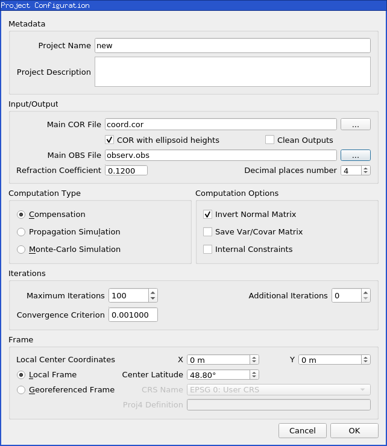
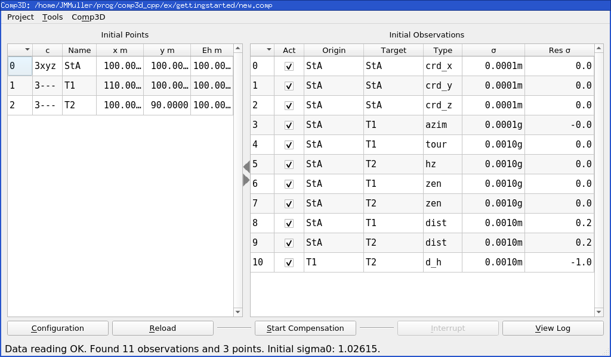
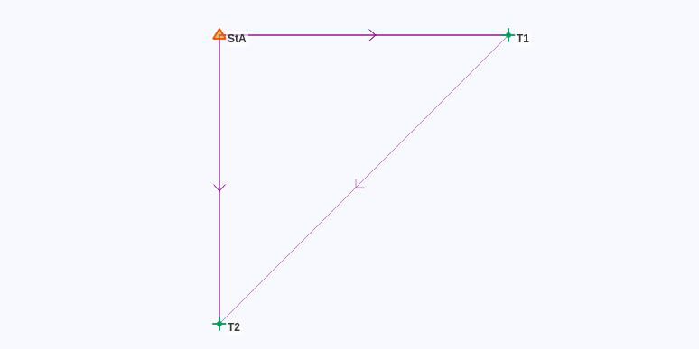

.. _getting-started:

==================
Getting Started
==================

Example data can be found into the *datasets/gettingstarted/* folder: :download:`coord.cor <../datasets/gettingstarted/coord.cor>`, :download:`observ.obs <../datasets/gettingstarted/observ.obs>`.

.. _input-files:

Input Files
===========

All coordinates and observations files are text files with fields delimited by any number of spaces or tabs. Blank lines are overlooked.

Example:

.. code-block:: none

    * Station 1
    7 S1  S3    0.0000  0.0020  0.001   *no heights
    5 S1  S2  391.3030  0.0020  0.001  0.0000 0.0000
    6 S1  S3   99.9280  0.0020  0.00   1.6170 1.5630
    6 S1  S2   99.8060  0.0020  0.00   1.6170 1.5790
    @monday.obs

.. _comments:

Comments
--------

The ``*`` character defines a comment that goes up to the end of the line.

The comments associated to an observation or a point will appear as such in the :ref:`.html report file <out-report>`.

.. _subfiles:

Subfiles
--------

Subfiles can be included in :ref:`.cor <corfiles>` or :ref:`.obs <obsfiles>` files with a ``@`` character preceeding their filename path relative to the current file.

.. _filepaths:

File Paths
----------

|c3| data files can be located in any directory with the following restrictions:

- spaces are not allowed in relative subfiles paths since they will be interpreted as field separators
- Windows, unlike other operating systems, is case-insensitive, so wrong case can be used for subfile inclusions, but this will not work on other OS

..
	- on Windows |c3| does not accept paths containing special characters (such as accents etc.); regardless of the operating system, it is always safer to have and accent-free absolute path

.. _create-proj:

Create a Project
==================
With the :ref:`.cor <corfiles>` and :ref:`.obs <obsfiles>` files, you can create a new project. In the |gui|, select ``Project>New``, choose a file name (to make things simple in the same folder as the data files) and fill in the ``Project Configuration`` form  as described in :ref:`project-params`. The mandatory parameters are the root :ref:`.cor <corfiles>` and :ref:`.obs <obsfiles>` files and the input frame (for the getting started example, the default local frame is sufficient).

The new project is then automatically loaded into the main window.

Main Window
========================

Once the project is loaded in the |gui| with ``Project>Open``, the project reading messages are shown.

Use ``Configuration`` button to make changes on project parameters, ``Reload`` to reload input files, ``Start Compensation/Propagation/Monte-Carlo`` to start the action or ``View Log`` to open the :ref:`html report file <out-report>`.

The |gui| contains two main tables (as described in :ref:`gui-tables`):

- list of points
- list of observations

Observations can be activated or deactivated using the ``Act`` field (see :ref:`gui_obs_activ`).

Html Report
===========

The html report is automatically generated at the end of computation. It can be loaded in the system default web browser with the ``View Log`` button. Using this button before computation, as expected, it will open the report in the initial state before computation.

The computation report shows the map, the initial and final coordinates and the list of observations with many statistical indicators.

For |more|, see :ref:`out-report`.

Quick Review of an Example
==========================

The example in *datasets/gettingstarted/* folder is simply one total station (*StA*) measuring two targets (*T1* and *T2*).
A height difference between *T1* and *T2* is added to give some redondancy.

Example of .COR File
--------------------

See example *.cor* file in *datasets/gettingstarted/coord.cor*

.. literalinclude:: ../datasets/gettingstarted/coord.cor

In this example, only one point is declared, it provides minimal information to set the position of the project.

The point *StA* was chosen as all the other points can easily be determined from it in this project. The other two points will be inferred from the *.obs* file.

For |more|, see :doc:`cor`.

Example of .OBS File
--------------------

See example *.obs* file in *datasets/gettingstarted/observ.obs*

.. literalinclude:: ../datasets/gettingstarted/observ.obs

In this example, an azimuth between two points is used to give the orientation of the whole figure.
Then we have total stations observations from *StA* to *T1* and *T2*, and a leveling measurement between *T1* and *T2* to give some redondancy.

.. note::
   In |c3|, all linear observations values are in meters and angular observations values are in grads (gons).

For |more|, see :doc:`obs`.

Computation
-----------

When the project is loaded, the coordinates of the undeclared points are initialized, if possible.
Then, the initial residual of every observation and the *initial* :math:`\sigma_0` is given.

The *final* :math:`\sigma_0` is obtained after computation. In this example, it is close to 1, meaning that the weights of the observations are coherent with their residuals.

For |more|, see :doc:`computation`.
