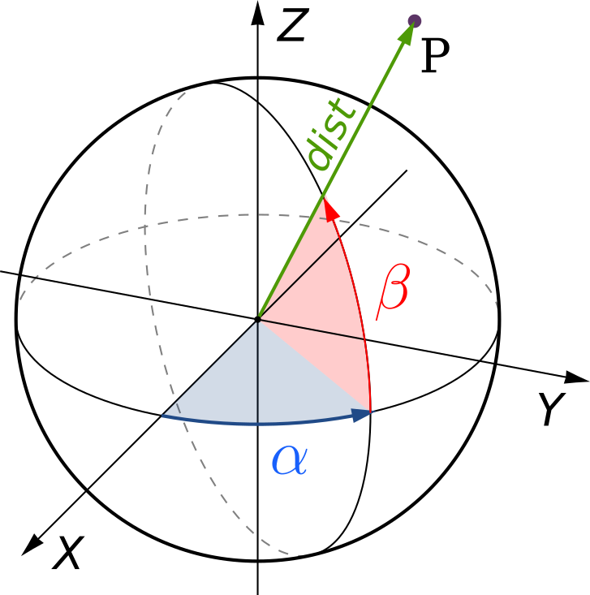
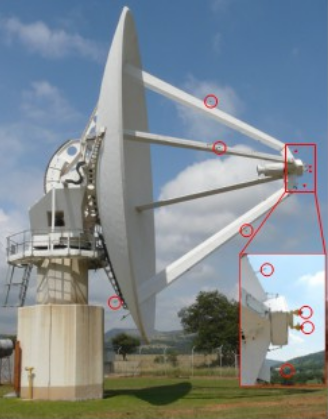
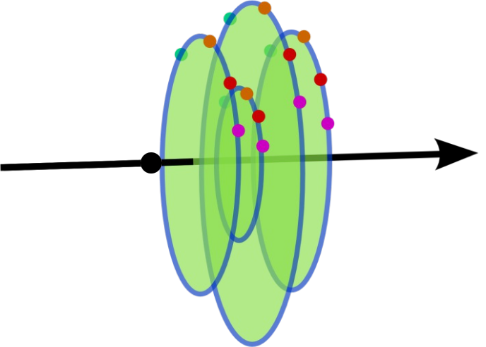
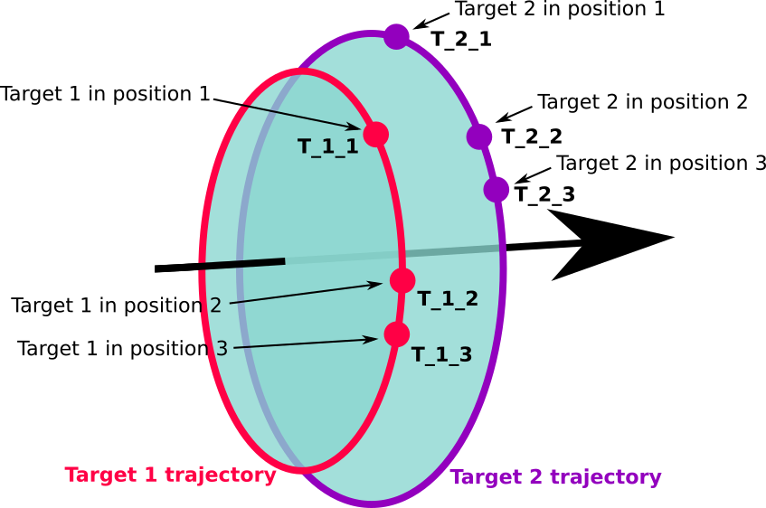

.. _obsfiles:

=========
OBS File
=========

The *.obs* file contains simple observations and parametric stations declarations.

Each line in an *.obs* file defines:

 - a simple observation (see :ref:`simple-obs`)
 - a parametric station (see :ref:`parametric-station`)
 - a reference to an *.obs* subfile (see :ref:`subfiles`)

.. _simple-obs:

Simple Observations
====================

As mentioned in :ref:`overview`, all values and sigmas are in meters for linear observations
and in grads (gons) for angular observations.

.. _simple-obs-protocol:

Protocol for Simple Observations
--------------------------------

Simple observations definition contains the following fields:

    +----------------------------------------------------------------------------------------------------------+
    | :math:`code\ origin\ target\ value\ \sigma_{abs}\ [\sigma_{rel}\ [h_{station}\ h_{target}]]\ [*comment]` |
    +----------------------------------------------------------------------------------------------------------+

- *code*: observation code (if negative, the observation will be deactivated as explained in :ref:`deactivated-obs`)

    - for linear observations:
        - ``1`` or ``3``: slope distance adjusted for atmospheric propagation
        - ``2``: geodetic distance at ellipsoid level between two points
        - ``4``: height difference between two points
        - ``9``: planimetric centering
        - ``14``: Easting coordinate difference
        - ``15``: Northing coordinate difference

    - for angular observations:
        - ``5``: horizontal angle
        - ``6``: zenith angle without refraction correction
        - ``7``: reference of horizontal angles' round
        - ``8``: azimuth between two points

- *origin*: station name

- *target*: target name

- *value*: observation value

- :math:`\sigma_{abs}`: fixed part of observation's standard deviation (if negative, the correspondant observation will be deactived as explained in :ref:`deactivated-obs`)

- :math:`\sigma_{rel}`: standard deviation relative to computed distance between the two points' coordinates at current iteration

- :math:`h_{station}`: station height

- :math:`h_{target}`: target height

.. note::
    The planimetric centering (code ``9``) is a pseudo-observation and it is replaced, when importing the *.obs* file, by two observations: one observation with code ``14`` and one code ``15`` and measured value is not taken into account, it is forced to 0.

.. note::
    A reference of horizontal angles' round (code ``7``) adds a new unknown in orientation; all the measurements code ``5`` from the same station following this code will be in the same round. If a code ``5`` is not preceeded by a code ``7``, it will be considered as a reference of horizontal angles' round.

.. note::
    The final precision of an observation takes into account the absolute precison and the one relative to the computed distance between the two points' coordinates at current iteration:

    - for linear measurements: :math:`\sigma_{abs} + \sigma_{rel} \cdot distance`

    - for angular measurements: :math:`\sigma_{abs} + \frac{\sigma_{rel}}{distance}`

.. note::
    In case of required high precision, it is not recommended to use the heights of the station and target, as they have no precision. It is necessary to duplicate the points at each height difference and use a planimetric centering (code ``9``) and height difference between the two points (code ``4``), for which a precision can be defined (see :ref:`simple-obs-example`).

.. _simple-obs-example:

Example of Simple Observations File
------------------------------------------

.. code-block:: none

 *code origin target value  sigma_abs sigma_rel h_station h_target
 
  8    S1     S5    300.0000 .0002    0.00      .0000     .000
                                                         
  *Station 1                                             
  7    S1     S3       .0000 .0020    0.001                      *no heights
  5    S1     S2    391.3030 .0020    0.001     .0000      .0000 *angle_precision=2mgr+1mm/Dcoord
  6    S1     S3     99.9280 .0020    0.00     1.6170     1.5630
  6    S1     S2     99.8060 .0020    0.00     1.6170     1.5790
  1    S1     S2     10.1060 .0010                               *no sigma_rel, no heights
  1    S1     S3     12.1360 .0010    0.0001                *dist_precision = 1mm + 0.0001*Dcoord
                                                         
  *Station 2                                             
  7    S2     S1       .0000 .0020    0.001     .0000     .0000
  5    S2     S3    220.3200 .0020    0.001     .0000     .0000
  6    S2     S1    100.4150 .0020    0.00     1.5560    1.5560
  6    S2     S3     99.5980 .0020    0.00     1.5560    1.5950
  3    S2     S3     13.6450 .0010    0.000    0.0000    0.0000
 
 *Centering of station S5 above groundmark M5
  9    M5    S5       0.000  0.003    0.0001 *horizontal_precision: 3mm on E, 0.1mm on N
  4    M5    S5       1.619  0.005    0.0001 *dist_precision=5mm + 0.1mm*Dcoord

.. _deactivated-obs:

Deactivated Observations
-------------------------

A simple observation can be deactivated in order to be removed from the bundle adjustment computation while being kept in the final report (grayed out) and computing its residual.

Observations can be temporarily deactivated in the |gui| (see :ref:`gui_obs_activ`) for quick tests.

In order to record the status of observations, all changes must be done in the *.obs* files. To deactivate an observation in the *.obs* file, add a ``-`` in front of its code or its absolute precision.

Example:

.. code-block:: none

      7 S1  S3     .0000    .0020  0.001  .0000  .0000  * active
      6 S1  S3   99.9280   -.0020  0.00  1.6170 1.5630  * deactivated
     -5 S1  S2  391.3030    .0020  0.001  .0000  .0000  * deactivated
      5 S1  S2  391.3030    .0020  0.000  .0000  .0000  * active
     *5 S2  S3  220.3200    .0020  0.001  .0000  .0000  * commented, hence removed

.. _parametric-station:

Parametric Observations
=======================

A parametric observation uses a subfile containing a list of observations sharing a set of unknowns.

They are declared in an *.obs* file and each parametric observation type has its own protocol.

.. _cartesian-subframe:

Cartesian Subframes
-------------------

The protocol of a cartesian subframe (code ``11``) in *.obs* file is:

    +-----------------------------------------------------------+
    | :math:`11\ origin\ @file.xyz\ [vertical\ [K]]\ [*comment]`|
    +-----------------------------------------------------------+

Code ``11`` is used in case of frame change computation or terrestrial lidar measurements adjustment.

- Optional parameters:

  - *vertical*: ``V`` (or ``1``) indicates that the station is verticalized, i.e. the subframe's Z axis is vertical. ``N`` (or ``-1``) means that the station isn't verticalized (default: not verticalized)
  - *K*: factor to be applied to the standard deviations in the cartesian subframe file (default: 1)

The observations file *.xyz* contains the cartesian coordinates of points in a subframe centered on *origin*. Each line in the *.xyz* file contains the point name, its coordinates in the subframe and its precision(s).
Therefore, the possible protocols in *.xyz* file are:

    +------------------------------------------------------------------------------------------------------+
    | :math:`target\ X\ Y\ Z\ \sigma_{XYZabs}\ [*comment]`                                                 |
    +------------------------------------------------------------------------------------------------------+

    +------------------------------------------------------------------------------------------------------+
    | :math:`target\ X\ Y\ Z\ \sigma_{XYZabs}\  \sigma_{XYZrel}\ [*comment]`                               |
    +------------------------------------------------------------------------------------------------------+

    +------------------------------------------------------------------------------------------------------+
    | :math:`target\ X\ Y\ Z\ \sigma_{Xabs}\  \sigma_{Yabs}\  \sigma_{Zabs}\  \sigma_{XYZrel}\ [*comment]` |
    +------------------------------------------------------------------------------------------------------+

    +------------------------------------------------------------------------------------------------------------------+
    | :math:`target\ X\ Y\ Z\ \sigma_{Xabs}\  \sigma_{Yabs}\  \sigma_{Zabs}\  \sigma_{XYZrel}\  h_{target}\ [*comment]`|
    +------------------------------------------------------------------------------------------------------------------+

The target height (:math:`h_{target}`) is given along the vertical.

Example of code ``11`` *.xyz* file:

.. code-block:: none

     101   2.373710    7.663746  -1.996344 0.002
     102 -14.941542   12.140255  -2.473924 0.003 0.00002
     103 -20.106478   -0.393074  -0.579412 0.002
     104 -16.827297  -16.081907   1.832123 0.005
     105  -2.921242  -18.014613   2.047338 0.002

A negative :math:`\sigma_{abs}` on a dimension will deactivate the corresponding observation(s).

.. note::

    In the *.xyz* file, a *0 0 0* measurement is not allowed, as this describes the origin of the subframe, that is given in the *.obs* file.

.. note::

    In the *.xyz* file, all coordinates must be cartesian coordinates. In order to build a *.xyz* file from |c3| outputs, it is mandatory to use cartesian coordiantes and not a *.cor/.new* file (see :ref:`export-coord`).

A subframe has three orientation parameters unless it is verticalized, in which case it has only one orientation parameter.

.. _polar-subframe:

Polar Subframes
----------------

The protocol of a polar subframe (code ``12``) is:

    +-----------------------------------------------------------+
    | :math:`12\ origin\ @file.xyz\ [vertical\ [K]]\ [*comment]`|
    +-----------------------------------------------------------+

Code ``12`` is used in case of non-verticalized total station, laser tracker or photogrammetric measurements.

- Optional parameters:

  - *vertical*: ``V`` (or ``1``) indicates that the station is verticalized, i.e. the subframe's Z axis is vertical. ``N`` (or ``-1``) means that the station isn't verticalized (default: not verticalized)
  - *K*: factor to be applied to the standard deviations in the polar subframe file (default: 1)

The observations file *.xyz* contains the polar coordinates of points in a subframe centered on *origin*. Each line in the *.xyz* file contains the point name, its polar coordinates (pseudo-horizontal angle :math:`\alpha`, pseudo-vertical angle :math:`\beta`, distance) and their precisions.

Polar measurements in instrument subframe are as follows:

The possible protocols in *.xyz* file are:

    +-----------------------------------------------------------------------------------------------------------------------+
    | :math:`target\ \alpha\ \beta\ dist\  \sigma_{\alpha\beta_{abs}}\ \sigma_{dist_{abs}}\ \sigma_{dist_{rel}}\ [*comment]`|
    +-----------------------------------------------------------------------------------------------------------------------+

    +----------------------------------------------------------------------------------------------------------------------------------------------------------------+
    | :math:`target\ \alpha\ \beta\ dist\ \sigma_{\alpha\beta_{abs}}\ \sigma_{\alpha\beta_{rel}}\ \sigma_{dist_{abs}}\ \sigma_{dist_{rel}}\ [h_{target}]\ [*comment]`|
    +----------------------------------------------------------------------------------------------------------------------------------------------------------------+

The target height (:math:`h_{target}`) is given along the vertical.

Example of code ``12`` *.xyz* file:

.. code-block:: none

     106  235.1192   1.0954  10.3290  0.0008  0.0004 0.0001
     103  314.7766   2.1551  11.9265  0.0008  0.0001 0.0004 0.0001
     102  355.5203  15.0235  10.6610  0.0008  0.0001 0.0004 0.0001 0.020
     101    5.1767   1.8137   5.7810  0.0008  0.0004 0.0001

A negative :math:`\sigma_{abs}` will deactivate the corresponding observation(s).

A a polar subframe has three orientation parameters, unless it is verticalized, in which case it has only one orientation parameter.

When a polar subframe is used for photogrammetric measurements, the distances have to be set to value 0 and have a negative sigma to be deactivated.

.. note::

    To generate *.xyz* file with MicMac (https://github.com/micmacIGN/micmac) from a 2d points xml file and a camera calibration:
    
    ``mm3d Bundles2Comp camera_calibration.xml 2d_measurements.xml Distance=0``

.. _rotation-axis:

Rotation Axes
--------------

The protocol of a rotation axis (code ``18``) is:

    +-----------------------------------------+
    |:math:`18\ origin\ @file.axe\ [*comment]`|
    +-----------------------------------------+

Code ``18`` is used to determine a rotation axis of an object (e.g. a telescope). Targets are fixed to the structure of the object, topometric measurements on these targets are carried out for different positions of the object when it is revolving around its axis.

Each target describes a circle when the object moves. Each of these circles is perpendicular to this axis and has its center on the rotation axis.

The *origin* point is on the axis. Two parameters are added for the axis direction, and two parameters per target: the circle position along the axis and its radius.

The *.axe* file contains the list of topometric points (:math:`pt`) corresponding to the different targets (:math:`target`) in the different object positions (:math:`pos`) and precisions corresponding to the stability of the circles: stability of radius (:math:`\sigma_{radius}`) and stability of their perpendicularity to the axis (:math:`\sigma_{perp}`).
Therefore, the protocol in *.axe* file is:

    +-------------------------------------------------------------------+
    |:math:`target\ pos\ pt\ \sigma_{radius}\ \sigma_{perp}\ [*comment]`|
    +-------------------------------------------------------------------+

Example of object axis observation:

The corresponding *.axe* file:

.. code-block:: none

      *target pos    pt    sigma_radius  sigma_perp
          1    1    T_1_1     0.0005        0.0005
          2    1    T_2_1     0.0005        0.0005
          1    2    T_1_2     0.0005        0.0005
          2    2    T_2_2     0.0005        0.0005
          1    3    T_1_3     0.0005        0.0005
          2    3    T_2_3     0.0005        0.0005
          L  OTHER_POINT

In this example, T_1_1, T_1_2 and T_1_3 represent topometric points and they correspond to the same target (1) fixed on the object, which was turned in three positions (1, 2, 3).

The last line in the example gives a constraint on the position of the origin point along the axis: it will be the orthogonal (hence the ``L``) projection of another topometric point on the axis.

Two axis can be declared on the same origin point: the two axes will intersect at the origin. In this case, there is no need for a ``L`` line in the *.axe* files.

A negative :math:`\sigma` will deactivate the corresponding observation.

.. _gnss-baselines:

GNSS Baselines
--------------

GNSS baselines (code ``19``) are vectors between a station and its targets, in cartesian geocentric coordinates frame, with covariances.

.. note::

    GNSS baselines can only be used in a georeferenced project.

The protocol of GNSS baselines *.obs* file is:

    +---------------------------------------------------------+
    |:math:`19\ pt\ @file.bas\ [K\ [h_{station}]]\ [*comment]`|
    +---------------------------------------------------------+

- *pt*: starting point of all baselines described in *.bas* file
- optional parameters:

  - *K*: factor to be applied squarred to the baselines' variance-covariance matrix; this amends for potential overestimation of the output precision given by the GNSS software (default: 1)
  - :math:`h_{station}`: station height (default: 0)

The *.bas* file contains, for each point, its name, vector from the station, variance-covariance upper-half matrix, and, eventually, target height. Therefore, the protocol in *.bas* file is:

    +----------------------------------------------------------------------------------------------------------------------------------------------------------------+
    | :math:`target\  \Delta X\  \Delta Y\  \Delta Z\  \sigma_{XX}\  \sigma_{XY}\  \sigma_{XZ}\  \sigma_{YY}\  \sigma_{YZ}\  \sigma_{ZZ}\  [h_{target}]\ [*comment]` |
    +----------------------------------------------------------------------------------------------------------------------------------------------------------------+

.. note::
     The vector  and the upper-half matrix must be given in cartesian geocentric frame.
     Station's and target's heights (:math:`h_{station}` and :math:`h_{target}`) are given along the vertical.

This file protocol has the advantage of being easily extracted from a `sinex <https://www.iers.org/IERS/EN/Organization/AnalysisCoordinator/SinexFormat/sinex.html>`_ file.

The tool :ref:`infinity-asc-to-bas` converts `Leica Infinity software
<https://leica-geosystems.com/fr-fr/products/gnss-systems/software/leica-infinity/>`_ *.asc* files into *.bas* files.

.. note::
    If the GNSS software has already taken into account all antenna heights, their values should be put to 0 in |c3| and thus avoid to be taken into account twice.
    
    If |c3| takes antenna heights into account, instead of the GNSS software, it guarantees that the vertical deflection is used.

To deactivate a baseline, :math:`\sigma_{XX}`, :math:`\sigma_{YY}` or :math:`\sigma_{ZZ}` must be set to a negative value.
It is impossible to deactivate only one component of a baseline.

.. note::
    :math:`\sigma_{XY}`, :math:`\sigma_{XZ}` and :math:`\sigma_{YZ}` might have negative values.

.. _obs-equal:

Equality Constraints
--------------------

Equality contraints are used for points sharing a commun constraint per pair (e.g., same distance).

The protocol to create an equality constraints set in *.obs* file is:

    +----------------------------------------------+
    |:math:`code\ @file.eq\ [*comment]`            |
    +----------------------------------------------+

Available codes:
    - ``21``: equal height differences
    - ``22``: equal distances

The input file *.eq* contains the list of points pairs sharing the same constraint:

    +------------------------------------------------------------------------------------------------------+
    | :math:`point1\ point2\ \sigma\ [*comment]`                                                           |
    +------------------------------------------------------------------------------------------------------+

Example of code ``22`` *.eq* file, where the ``Bn`` points are on a sphere centered on ``A``:

.. code-block:: none

     A B1 0.001
     A B2 0.001
     A B3 0.001

A negative :math:`\sigma` will deactivate the corresponding observation.

